# GESTIÓ CURSOS EN GESFORM

En aquest tutorial expliquem tot allò que estpa relacionat amb Gesform i la gestió de cursos. És important que seguiu els passos indicats per tal de no tindre problemes a l'hora de gestionar les formacions.

Voreu que al llarg del procés de vida d'una formació caldrà que vingueu ací per a consultar el procediments corresponent.

## COM CREAR UN CURS NOU

Qual volem crear una formació nova podem duplicar una semblant o crear una des de zero. Si comencem a crear l'edició des de cero cal:

Anar a **Mis Ediciones -- Ver**

{: .center }

Anem al tercer icono **Añadir nuevo Registro**

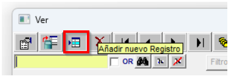{: .center }

 Caldrà omplir la fitxa que apareix:

{: .center }

A continuació hi ha els diferents camps que cal omplir i una fitxa completa amb la informació.

-   **Convocatòria** - Cal escollir una convocatòria segons el tipus de formació que es vol realitzar:
    -   FSE 2025
    -   PAA + període en què es realitza la formació (per exemple: PAA Setembre-Desembre 2025)
    -   Skills 2025
    -   Competència Digital
    -   Administracions Públiques

-   **Acción Formativa** - "Percha" - Mirar de les diferents perxes quina s'adapta més a la nostra formació.

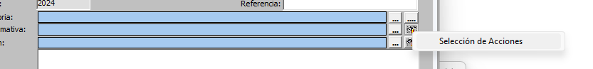{: .center }

Posem l'àrea **97** i **consultar**

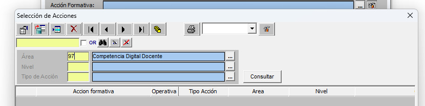{: .center }

!!!warning "Important" 
    Utilitzeu de base la formació 19FP43CF144 (Didàctica) si no voleu que vos afegixca cap informació extra. Paga la pena fer-ho així per controlar tota la informació que s'ha d'afegir.

-   **Delegación** - CEFIRE de Formació Professional i ERE

-   **Titulo / Título V**

-   **Área:** 97 -- **Horas i plazas** (nombre de places que s'oferten)

-   **Tipo de acción** - CD (Curs a distància), C (Curso), etc...

-   **Nivell** -- CF (En el cas que siga de formació professional)

-   **Lugar** -- ADIST: En el cas que siga 100% a distància, ADISTSINC: En el cas que siga 100% a distància però amb sessions síncrones

-   **Fecha inicio y fin** de la formació

-   **Dates inscripción inicio i fin, confirmación (final), despublicar** (dos setmanes després de començar)

{: .center }

!!!warning "Important"
    Basant-se en les dates d'inscripció inici i fi... es recomana que com a mínim hi haja 1 mes d'inscripció,  1 setmana de confirmació i despublicar dos setmanes després de començar la formació.

A continuació **Aplicar** per tal que aparega marcat la X en perfil i tinguem el **codi de referència.**

!!!warning "Important"
    "Important" Este pas és extremadament important, cal vore una X en el perfil, si no apareix la X i modifiques alguna cosa estaràs modificant totes les formacions del CEFIRE que "perxen" d'eixa formació i crearàs un **desastre monumental**.

Ara caldrà introduir les característiques del curs. En la icona que hi ha al costat de la X del perfil i triar l'opció **Mantenimento**

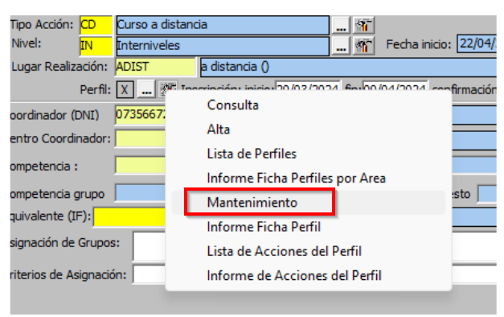{: .center }

Omplim la **informació** referent al curs. Objectius, Continguts, Material didàctic, Condicions, Observacions, Dirigit a. Podeu consultar el text de [FSE ací](fse.md)

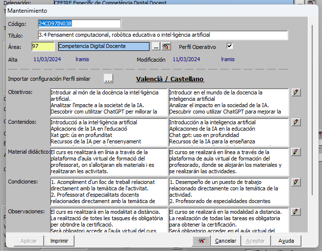{: .center }

**OBJECTIUS**: Objectius que es pretenen aconseguir en el curs

**CONTINGUTS**: Continguts que es treballaran al curs.

**MATERIAL DIDÀCTIC**: Si el curs és online a AULES caldria posar:

```html
El curs es realitzarà en línia a través de la plataforma d'aula virtual de formació del professorat, on s'allotjaran els materials i es realitzaran les activitats.
```

**CONDICIONS:** (informació donada per la SDGFP)

```html
1. Acompliment d'un lloc de treball relacionat directament amb la temàtica de l'activitat.

2. Professorat d'especialitats docents relacionades directament amb la temàtica de l'activitat.

3. Orde d'inscripció seguint el següent criteri:

Personal docent en actiu en centres sostinguts amb fons públics. (De titularitat pública i privats concertats. Art. 108 LOE 2/2006).

Personal tècnic educatiu en actiu en centres sostinguts amb fons públics. (De titularitat pública i privats concertats. Art. 108 LOE 2/2006).

Personal inscrit en alguna de les bosses de personal docent de la Conselleria d'Educació, Universitats i Ocupació.

Resta del professorat. l curs es realitzarà en línia a través de la plataforma d'aula virtual de formació del professorat, on s'allotjaran els materials i es realitzaran les activitats.
```

**OBSERVACIONS:** Si el curs és online a AULES, un exemple seria:

```html
El curs es realitzarà en la modalitat a distància. La realització de totes les tasques és obligatòria per obtindre la certificació. Serà obligatori accedir a l'aula virtual del curs durant els tres primers dies des de l'inici.
```

**DIRIGIT A:** (informació donada per la SDGFP)

```html
Personal docent i personal tècnic educatiu amb destinació en centres educatius no universitaris de la Comunitat Valenciana en els quals s'impartisquen els ensenyaments regulats per la Llei orgànica d'Educació.

Personal docent i personal tècnic educatiu que preste servicis tècnics de suport educatiu als centres indicats en l'apartat anterior.

Personal que haja finalitzat els graus i màster que conduïxen a l'obtenció de la titulació docent, sempre que es troben inscrits en alguna de les bosses de personal docent de la Conselleria d'Educació, Universitats i Ocupació i este personal no supose més del 50% de participació en l'activitat.
```

I **apliquem** i **aceptem**.

Per últim abans de portar a validar per part del director anem a la **icona que hi ha al costat de Apuntes**

{: .center }

I triem l'opció **Presupuesto**

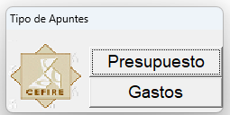{: .center }

Afegim nou registre i omplim la informació

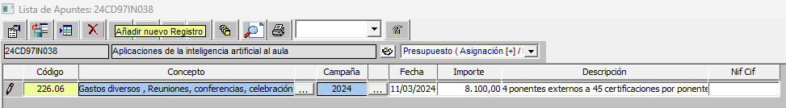{: .center }

!!!info "Codis"
    - **Código**: 226.06 Gastos diversos, Reuniones, conferencias, celebración de actos y cursos (personal no docente)
    - **Código**: 233.02 Gastos de formación del personal docente
    - **Importe**: Import que es preveu gastar en la formació.
    - **Descripción**: Breu descripció del curs i de les seues característiques (tarifa aplicada)

I **Apliquem** i **Acceptem.**

!!!warning "Important"
    Una vegada estiga el curs és important que poseu en Kanban el curs per a que siga validat per part del director. Si no es posa en Kanban no es podrà validar.

Una vegada estiga validat el curs tant per part del director com per part de la SDGFP, ja es podrà publicar i començar a gestionar les inscripcions. No em d'oblidar que si el curs és online a AULES caldrà demanar l'espai en AULES.

[:simple-moodle: Demanar espai en Aules](https://forms.office.com/pages/responsepage.aspx?id=FBHdc33vx0CGaVadMufim4P9l-8HwURGslHVd49kW6BUQVk3OFgzOVBZRVpaR1JRSFk3NjIwMkpaSS4u&route=shorturl){: .md-button target="_blank"}

## PASSAR A CONFIRMAR UN CURS I BAREM

Una vegada finalitzat el període de d'inscripció cal ordenar als participants per passar el curs a **confirmació**.

Anar a **Mis Ediciones -- Ver -- Extintor - Gestión solicitud de participants**

{: .center }

Treballarem en la pantalla que apareix en la que consten tots els inscrits.

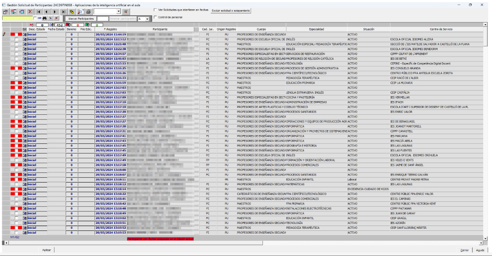{: .center }

   El primer que farem serà mirar si com a participant apareix alguna persona amb el nom del coordinador. Aquests seran participants que no han sigut trobats per Gesform i els inscriu amb el nom del coordinador.

Si fem doble clic al nom del coordinador s'obrirà una finestra amb les dades de la persona que hi ha al darrere d'aquesta inscripció.

{: .center }

Copiem el DNI de la persona que hi ha en l'apartat de **Observaciones** i l'enganxem a la casella del DNI de **Persona** (a la mateixa finestra), si no apareix és que no és docent o encara no està donat d'alta.

Caldrà posar-se en contacte amb la persona per tal de comprovar si és docent o no. Si ho és caldrà donar d'alta a la persona. Escriurem un correu a **compteformacio@gva.es** amb totes les dades de la persona i el DNI per tal que ens donen d'alta a la persona. Cladrà posar-se abans en contacte amb ell per a que ens donen una prova com a que és docent. Recordeu que tots aquells docents de la Comunitat Valenciana (ensenyament reglats no universitaris) tenen dret a fer formació i per tant a inscriure's a les formacions del CEFIRE.

Una vegada ja tenim a tots els participants localitzats (els casos que tenim pendents el podem deixar per a un vegada acabe el termini de confirmació afegir-los). Anem a **Extintor -- Definir baremo**

{: .center }

Si apareix una finestra per solapament donar **Aceptar** per no excloure ara i posteriorment ho mirarem.

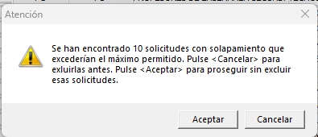{: .center }

En la següent pantalla caldrà definir les característiques que donen puntuació per tal d'ordenar als participants. **Si el curs té característiques que donen puntuació.**

**SITUACIÓN JURÍDICA** (FC -- Func carrera; FI - Interí; FP - Pràctiques; LA -- Laborals; CA - Catedràtics) Per exemple si és administracions públiques podriem posar 5 als interins i 10 als funcionaris de qualsevol tipus.

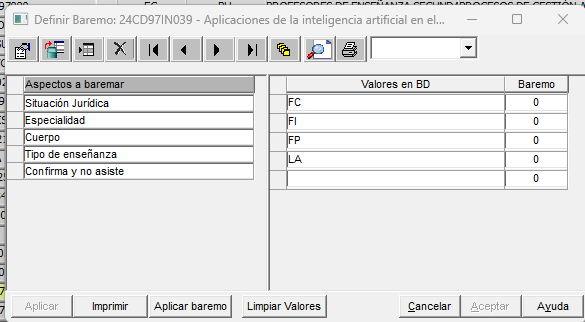{: .center }

**ESPECIALIDAD** I **CUERPO** -- Deixarem 0 si és internivell i si no determinar la puntuació a donar a cada especialitat o nivell.

**TIPO DE ENSEÑANZA** - PR -- Privada i PU - Pública

**CONFIRMA Y NO ASISTE** -- Si posa 0 és que no hi ha ningú dels inscrits que en altres formacions haguéren confirmat i no assistit i per tant penalitzariem, en aquest cas en el barém establirem una puntuació negativa. Per tal de penalitzar per aquesta situació.

Una vegada definit tot el barem **Aplicar -- Aceptar.**

**Refrescar** la pàgina, segona Icona.

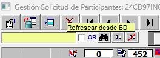{: .center }

A continuació caldrà **ordenar** als participants segons el seu barem.

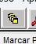{: .center }

De la finestra que apareix caldrà desmarcar l'opció **Desc. Estado** per que no ho tinga en compte.

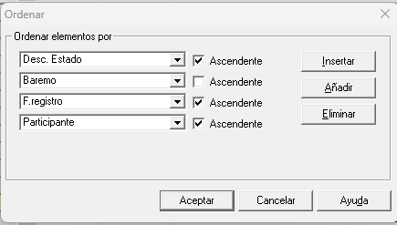{: .center }

Quedant de la següent manera la finestra:

{: .center }

En la llista de gent a la part de la dreta en la segona columna, la gent que té un quadradet vermell significa que està actualment en altres formacions amb dates coincidents.

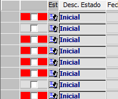{: .center }

Caldrà excloure a aquells participants que tenen ja 3 formacions (màxim que es pot realitzar). Per fer aquesta acció hi ha l'opció **Excluir solicitud x solapamiento** situada la part superior dreta.

{: .center }

Aquests participants apareixeran al final amb estat **Excluido**

{: .center }

Per comprovar si això és correcte cal seleccionar a un participant exclòs i clicar a la part superior **Ver Solicitudes que interfieren en fechas**

{: .center }

{: .center }

**NOTA**: Si apareix algun participant amb dues només pot ser que ja estiga admés a un altra però encara no actualitzat.

Una vegada revisat i ordenat amb relació al barem definit caldrà seleccionar tants participants com places hi ha al curs. En la finestra al costat dret de **Marcar Participantes** caldrà posar aquesta dada (places) i clicar a **Marcar Participantes**

{: .center }

{: .center }

**Apliquem**. Ordenem de nou i veurem que ara els participants seleccionats estan en Estat **Seleccionado** i els de llista d'espera estaran en Estat **Inicial**

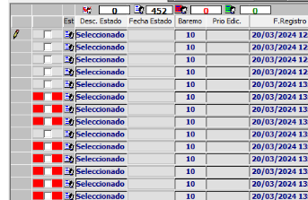{: .center }

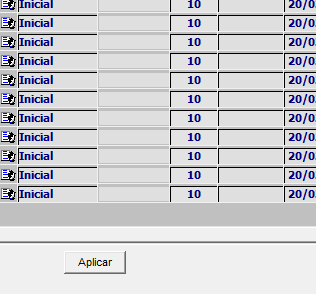{: .center }

Per tenir el mail per poder informar de l'inici de la confirmació caldrà exportar un excel de participants.

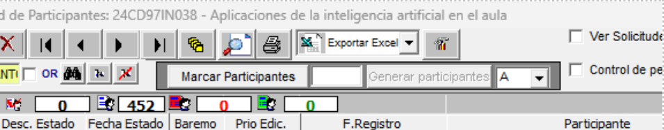{: .center }

Per tal que el curs estiga ja en confirmació pels participants, caldrà passar a estat confirmació. Per fer aquesta acció anem a **Extintor -- Estados y Cert. - Passar a estado de confirmación**

{: .center }

Finalment caldrà enviar un **missatge** a **tots els inscrits** informant que comença el període de confirmació.

El text per la redacció d'aquest correu està en el pdf **Coordinació.pdf** i és el següent:

**Exemple de correu de confirmació (el dia de llistes provisionals)**

```html
Benvolguts i benvolgudes,

Ja està disponible la llista provisional de professorat admés al curs \"YY\" (enllaç &usuario=formacion).

Es tracta d'un curs en línia de 30h que tindrà lloc entre el DD de MM de 202A i el DDde MM de 202A.

Podeu consultar el llistat i confirmar o renunciar la vostra participació seleccionant l'enllaç que apareix al costat del vostre nom, a la dreta de la pàgina.
Per favor, fins el dia D de MM, confirmeu o renuncieu en funció de les vostres preferències per a deixar places lliures si realment no esteu interessats o interessades.

Es publicarà el llistat definitiu a partir del dia D de MM.

Si voleu fer una consulta, envieu un correu a les assessories coordinadores:

XX@edu.gva.es o YY@edu.gva.es

Salutacions

XX i YY
```

## LLISTES DEFINITIVES PER PUBLICAR

Una vegada finalitzat el període de CONFIRMACIÓ, cal ordenar els participants i publicar les llistes definitives.

Abans de començar caldrà **Extintor/Despublicar internet --** A la part inferior apareixerà el quadret de Publicar Internet sense marcar.

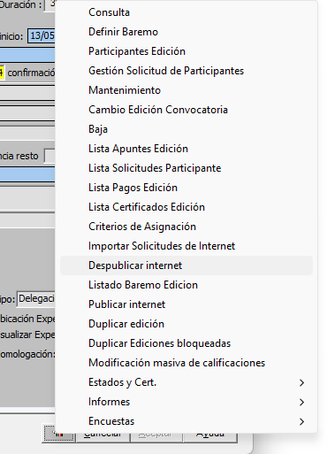{: .center } 

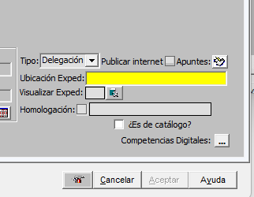{: .center }

Una vegada despublicat cal anar a **Extintor/Gestión Solicitud de Participantes**

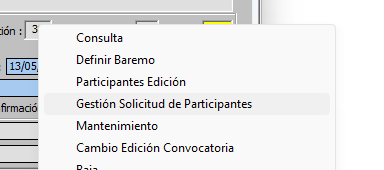{: .center }"

I anem a **ordenar** -- deixant els paràmetres que apareixen.

{: .center }
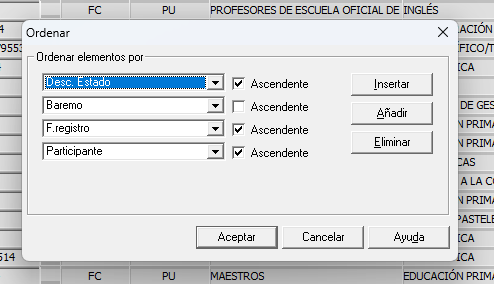{: .center }"

En la columna **Descripción Estado** tindrem als participants segons el seu estat:

 -   Confirmado -- Confirmat amb plaça
 -   Conf provisional -- Confirmat sense plaça (espera)
 -   Excluido
 -   Inicial -- No han fet res abans estaven en lista d'espera
 -   Seleccionado -- No han fet res, abans estaven en confirmat
 -   Renuncia

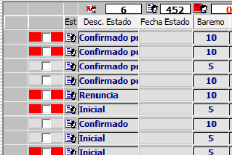{: .center }

Mirem si s'ha passat algun en la creació de les llistes provisionals que com a participant tenia el nom del coordinador. Ordenem als participants, si no estem segurs filtrem. Si s'ha fet correctament no hauria d'estar cap participant amb el nom del Coordinador.

Si queda algú donem doble clic al nom i s'obrirà una finestra amb les dades de la persona que hi ha darrere d'aquesta inscripció.

{: .center }

Copiem el DNI de la persona que hi ha en l'apartat de **Observaciones** i lo copiamos en la casilla del DNI de **Persona (de la mateixa finestra),** si no apareix és que no és docent o encara no està donat d'alta. Caldria trucar per vore la situació en la que es troba, mirar amb aquesta situació quin barem tindria i si no entra al curs -- Eliminar el registre. Si entraria cal demanar-li justificació de la seua situació (per exemple nómina) i donar d'alta en Persones en Gesform.

Una vegada ja tenim tots els participants amb la identitat correcta. Filtrem per **confirmados** i tindrem els confirmats i confirmats provisionals.

{: .center }

**Ordenem** de nou per estar segurs.

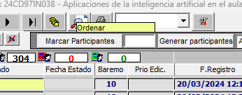{: .center }

Deixem tal qual apareixen els paràmetres de l'ordre.

{: .center }

Donem a **Excluir solicitud x solapamiento,** per tal que s'eliminen els participants que actualment están en 3 o més formacions i no podríen fer el curs. A les finestres que apareixen donem a **Aceptar**.

{: .center }

{: .center }

{: .center }

Mirem les persones que s'han exclòs per vore si tenen els cursos assignats i és correcta l'exclusió (3 cursos). Fem clic en la persona que volem mirar i posteriorment a la part superior a **Ver Solicitudes que interfieren en fechas**. Ens apareixerà la finestra per vore els cursos que té aquesta persona.

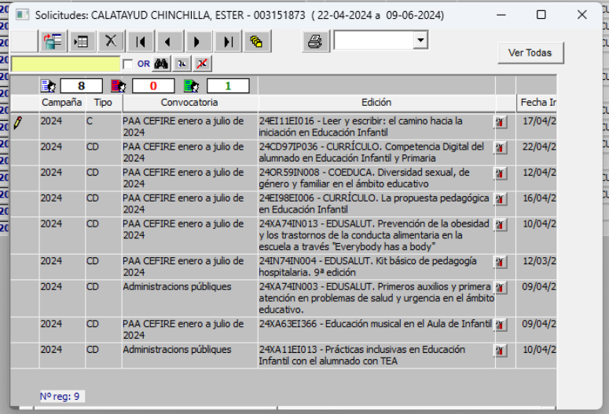{: .center }

**Ordenem** de nou per estar segurs.

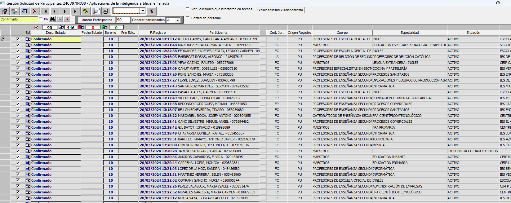{: .center }

**Marquem** els participants que hi haurà en l'edició (en aquest cas 90), posem el 90 i cliquem en **Marcar Participantes**.

{: .center }

Con los 90 marcados **exportamos** para tener estos participantes.

{: .center }

Donem ara a **Generar Participantes** A les següents finestres donem a **Aceptar**. Finalment donar a **Aplicar**.

{: .center }

{: .center }

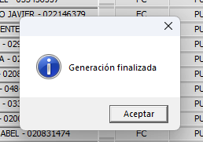{: .center }

Apareixeran en **verd** els participants.

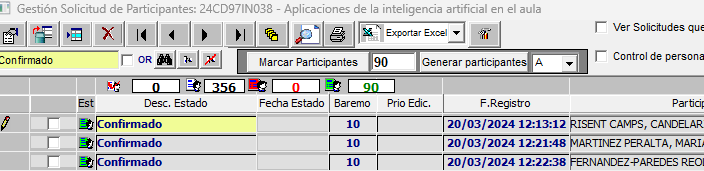{: .center }

Si ens hem equivocat i has marcat més participants o li has donat dos cops i hi ha el doble de participants en verd. Caldria eliminar-los tots i tornar a començar, per traure el verd, marquem el nombre de participants que tens en verd i apliquem. Així els eliminaria.

Finalment comprovar que estan en **Extintor -- Participantes Edición**

Tornar a **publicar**. Comprovar que s'han publicat en la web les llistes.

Una vegada publicat, cal enviar correu als participants per indicar que ja estan els llistats definitius. Model de **correu** a continuació.

El text per la redacció d'aquest correu està en el pdf **Coordinació.pdf** i és el següent:

**Exemple de correu de llistes definitives**

```html
Benvolguts i benvolgudes,

Ja està disponible la llista definitiva de professorat admés al curs \"24CD97ES038 -- Aplicaciones de la inteligencia artificial en el aula"

<https://cefire.edu.gva.es/sfp/index.php?seccion=edicion&id=11897023%20&usuario=formacion>

Podeu consultar-la en el següent enllaç:

<https://cefire.edu.gva.es/sfp/index.php?seccion=inscripciones/definitivo&id=11897023&usuario=formacion>

Recordeu que es tracta d'un curs en línia de 30h que tindrà lloc entre el 22 d'abril i el 9 de juny de 2024. 

El curs comença el dilluns. Les persones participants rebreu informació per accedir a l'aula virtual.

Informem que degut a l'alta demanda del curs demà eixirà a inscripció una nova convocatòria del mateix curs. Podeu vore la informació al següent enllaç:

<https://cefire.edu.gva.es/sfp/index.php?seccion=edicion&id=11965338&usuario=formacion>

Si voleu fer alguna consulta, envieu un correu a les assessories coordinadores: <l.ramisherrero@edu.gva.es>, <la.garciagisbert@edu.gva.es> o <s.barbergomez@edu.gva.es>

Salutacions, 

Lucía, Luis i Sergio.
```

### IMPORTA MASSIVAMENT PARTICIPANTS

En alguns casos tenim cursos que no pasen pel procés d'inscripció com a tal. Com per exemples els cursos de coordinadors del PAF, cursos d'ACREDITA, etc... Podem importar els participants directament a l'edició sense necessitat de passar per l'apartat d'inscripció. Anirem a "Importar solicitud de participants":

{: .center }

Ens pareixerà la següent pantalla:

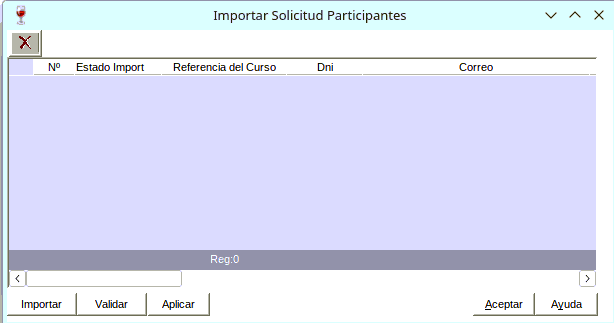{: .center }

I farem clic en Importar i ens demanarà un fitxer en format CSV i extensió .txt. És important que el fitxer estiga correctament formatat.

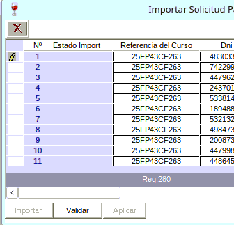{: .center }

Un vegada importat l'arxiu li donarem a validar, i ens apareixeran dos possibles estats:

* OK: És correcte i es pot importar.
* NOOK: Hi ha algun error i no es pot importar.

Cladrà comprovar eixos errors.

L'arxiu que s'ha d'importar ha de tindre el següent format:

```csv
25FP99CF999	12345678	xx.xxxxxr@edu.gva.es	NOM 	COGNOMS
25FP99CF999	12345678	xx.xxxxxr@edu.gva.es	NOM 	COGNOMS
25FP99CF999	12345678	xx.xxxxxr@edu.gva.es	NOM 	COGNOMS
```

* Els noms no van entre cometes.
* El primer camp és el codi de referència del curs.
* El segon camp és el DNI del participant.
* El tercer camp és el correu electrònic del participant.
* Els camps següents són el nom i els cognoms del participant.
* Els camps han d'estar separats per tabuladors, no per comes.
* El fitxer ha d'estar en format de text pla (.txt) i no en format Excel (.xlsx o .xls).

Podeu fer ús un document de Full de càlcul per a LibreOffice per a crear el fitxer CSV. Un cop creat, caldrà exportar-lo com a text pla (.txt) i assegurar-se que els camps estan separats per tabuladors. Podeu descarregar un exemple de plantilla [ací](../Docs/EXEMPLE.csv) per a utilitzar-lo com a guia. Caldrà que l'importeu al LibreOffice Calc i el modifiqueu.

Quan tingueu que crear un fitxer CSV, heu de Guardar como i Editar les opcins d'esportació.:

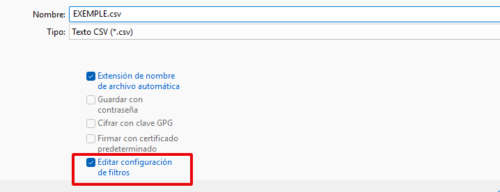{: .center }

Les opcions que heu de seleccionar són:

{: .center }

Una vegada tingueu guardat el fitxer heu de canviar-li l'extensió a .txt, per exemple: **EXEMPLE.txt**. I ja podeu importar-lo a Gesform.


## SINCRONITZA PARTICIPANTS EN AULES

Una vegada tenim creades i publicades les llistes definitives, ja se podria sincronitzar amb la finalitat de tenir als participants en AULES, però és convenient esperar a que estiga a punt de començar el curs per tal de tenir la llista més real possible (per si ha hagut alguna renúncia des del moment de publicació de les llistes i el començament del curs).

Anem al nostre curs en **Aules**. I en el bloc administració obrim el desplegable **GVA Aules**

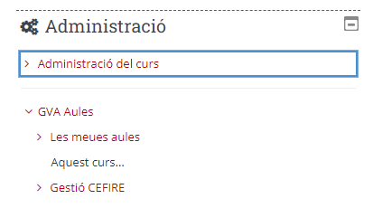{: .center }

Triem l'opció **Gestionar edicions**

{: .center }

Triem el curs que volem sincronitzar

{: .center }

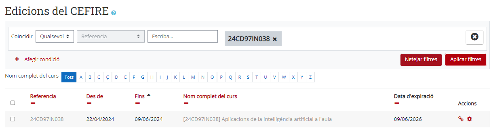{: .center }

Una vegada tenim el curs anem a **gestionar** a la rodeta dentada.

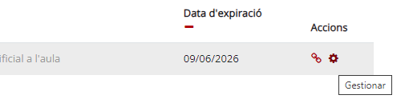{: .center }

Apareix la pantalla amb tots els participants del curs i els que ja estavem. A la part inferior tenim **Gestionar edició,** en el que podem indicar que volem sincronitzar, matriculacions i desmatriculacions. Si ja teníem algun participant matriculat manualment i que no està en gesform, caldrà desmarcar ¿**Sincronitzar desmatriculaciones?**

{: .center }

I **Actualitzem** curs.

## BAIXES I ALTES CURS

Una vegada publicat el llistat definitiu pot haver alguna petició de baixa. Caldrà gestionar la baixa i la posterior alta d'un participant en llista d'espera.

**GESTIÓ DE LA BAIXA** -- Entrar al curs en Gesform a **Gestión Solicitud de Participantes**

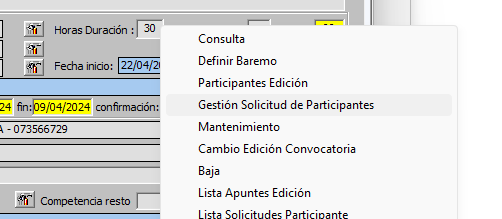{: .center }

Buscar la persona que vol donar-se de baixa. En la columna **Desc. Estado** fem doble clic a la paraula **Confirmado**, s'obrirà una finestra per canviaer l'estat a **Renuncia** i acceptem.

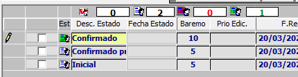{: .center }

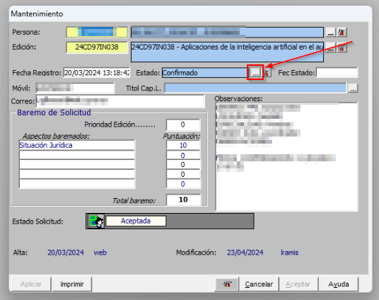{: .center }

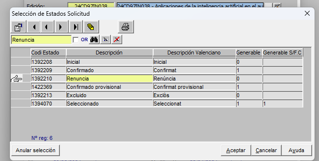{: .center }

Donem a **Aplicar** i acceptem la finestra emergent que ix. I **Aceptar** i acceptem la finestra emergent que ix.

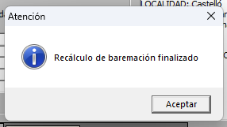{: .center }

Posteriorment cal entrar a **Participantes Edición.**

{: .center }

Busquem al participant i donem doble clic a la icona de la personeta.

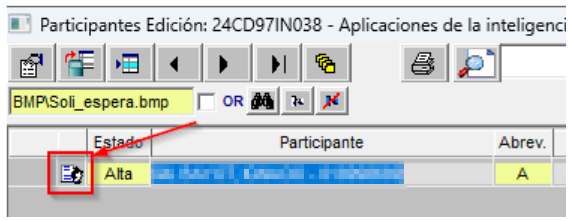{: .center }

S'obrirà una finestra emergent en la que tindrem que **canviar l'estat a Baja,** **Calificación No apto** i **obrim el desplegable per indicar el motiu.**

{: .center }

Busquem com a motiu **Renuncia** i **apliquem aceptem** i per que aparega al requadre caldrà clicar al quadrat que hi ha a la part de sota dels dos quadrats.

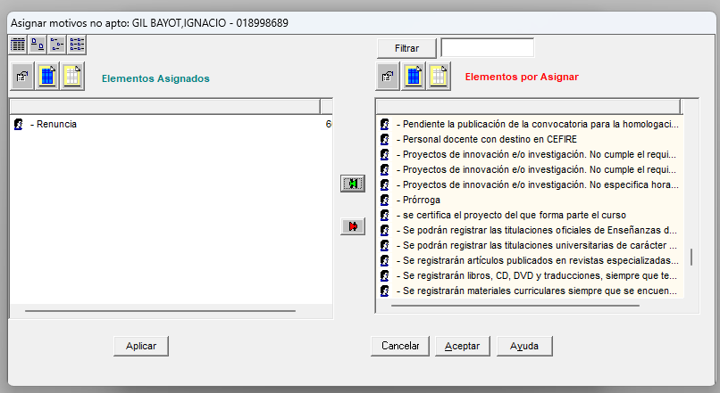{: .center }

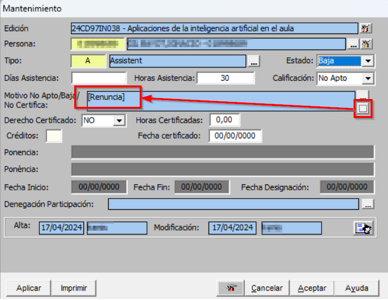{: .center }

**Apliquem** i **aceptem** i una vegada **refresquem** ja tindrem la persona de baixa.

{: .center }

**GESTIÓ DE L'ALTA** -- Una vegada tenim al participant de baixa caldrà anar a Gestió Solicitud de Participantes per trucar a la persona que està a continuació en la llista d'espera.

Una vegada entres està ordenat ja per agafar al primer participant que no estiga en verd.

{: .center }

Per accedir a les dades li donem doble clic al nom i apareix la seua fitxa. On estan les dades per poder posar-se en contacte.

Si algú diu que no vol, apuntar el nom per tal de tenir clar que no vol per si es produeix altra baixa.

Quan et diga algú que si copiem el DNI de la persona, anem a **Participantes Edición** li donem a crear nou registre.

{: .center }

Si diu "esta fuera de plazo" no pasa res, aceptar. Eixirà una finestra com aquesta en la que cal posar el DNI i donar a intro, posarem **Estado Alta**, **Calificación Apto** i en **Tipo A de assistent.**

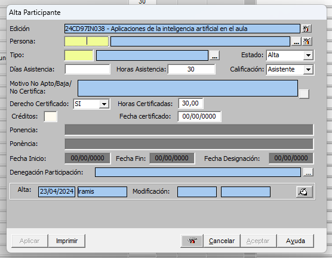{: .center }

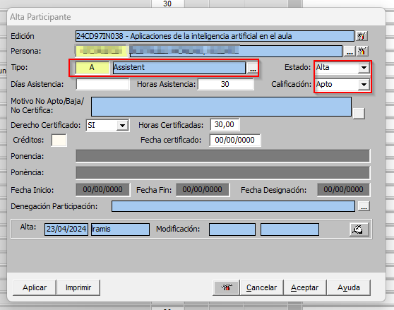{: .center }

**Refresquem** per vore si està en participants. La icona que apareix al costat de Alta serà diferent per que s'ha posat de manera manual.

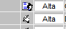{: .center }

Una vegada s'ha tramitat la baixa i l'alta caldrà **sincronitzar** a **Aules**.

## POSAR LES QUALIFICACIONS ALS ASSISTENTS

Quan els formadors ens passen les qualificacions caldrà introduir-les a GESFORM.

Entrar a l'edició on volem posar les qualificacions als participants. Anar a **Mis Ediciones -- Ver** i entrar a l'edició.

{: .center }

Anar a **Extintor -- Participantes Edición**

{: .center }

Per defecte tots els participants estan en APTO per tant només caldrà canviar a NO APTO als participants que no han superat el curs. Cerquem al participant que volem canviar a NO APTO i cliquem a la fitxa.

{: .center }

Una vegada en la fitxa canviem la qualificació a NO APTO i li donem als tres puntets per triar el motiu del NO APTO.

{: .center }

De la finestra que s'obri triem el motiu i li donem a la fletxa verda -- Apliquem i acceptem.

{: .center }

Finalment per que quede el motiu cliquem al requadre de baix dels tres puntets. I apliquem i acceptem.

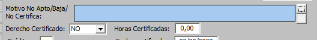{: .center }

### IMPORTA MASSIVAMENT QUALIFICACIONS

Si el curs disposa de molts participants, este procediment pot ser massa llarg. Per això, si el formador ens ha passat un fitxer amb les qualificacions, podem importar-les de manera massiva. Farem clic en "Modificación masiva de calificaciones".

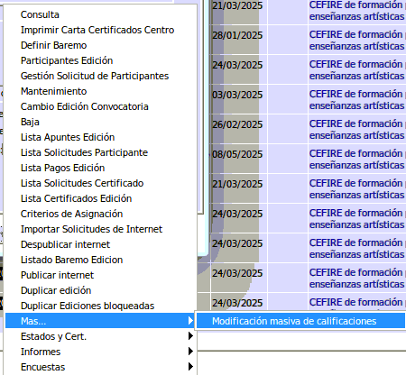{: .center }

Apareixerà una pantalla on podrem importar un fitxer amb les qualificacions. El format del fitxer ha de ser un CSV amb una columna: DNI, la resta d'opcions les seleccionarem em la finestra que apareix:

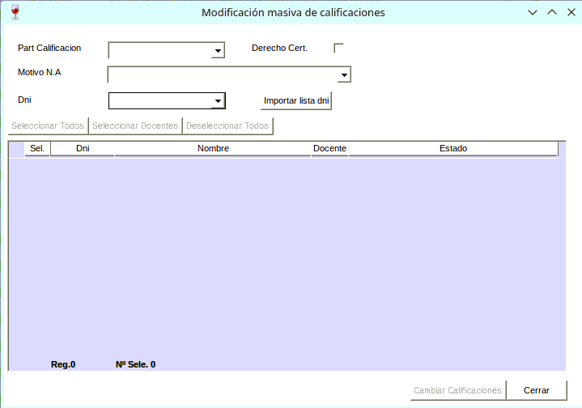{: .center }

* Part calificación: Triem la qualificació que volem posar, en aquest cas "No Apto".
* Motivo N.A.: Triem el motiu de la qualificació, en aquest cas "No realiza las actividades completamente".
* DNI: Escollim formato Gesform (Sense la lletra, només els números). Formato oficial sol donar problemes.

I fem clic en "Importar" lista de DNI. Caldrà que seleccionem un fitxer amb extensió txt, el fitxer només ha de contindre un llistat de DNI, sense comes ni cap altre caràcter. Un exemple de com ha de ser el fitxer:

```
12345678
23456789
34567890
45678901
```

Una vegada seleccionat el fitxer, fem clic en "Importar" i apareixerà una pantalla amb els DNI que s'han importat correctament. Si tot és correcte, fem clic en "Aplicar" i les qualificacions es posaran als participants.

!!!info "Nota"
    Es convenient abans de fer la importació massiva, comprovar si els participants estan tots com a Apto, així al posar el No Apto ja tindrem assegurats que està tot el llistat correcte.

<!--
## PASSAR A CERTIFICAR I GENERAR CERTIFICATS

!!!warning "IMPORTANT"
    Aquest procediment no l'ha de realitzar l'assessoria, sinó que és una tasca que realitza el director del CEFIRE. Per tant, caldrà comunicar-ho amb un fitza al Kanban.

Una vegada tenim els alumnes amb la seva qualificació caldrà passar el curs a Certificació, generar els certificats i l'acta i enviar a signar els certificats per part del director del CEFIRE corresponent i Acta (Coordinador del curs).

Ara caldrà passar el curs a certificació (anteriorment estaria en avaluació). Per passar a certificació cal anar a eines **Estados y Cert. / Passar a estado de certificación**

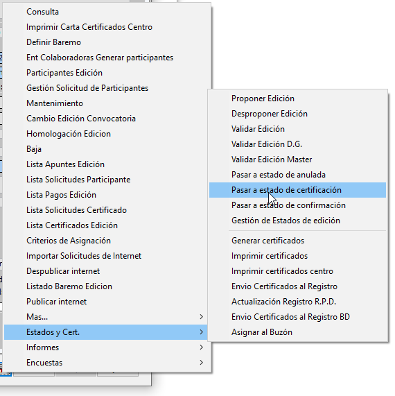{: .center }

Una vegada està en certificació caldrà generar els certificats. Anem a eines a **Estados i Cert / Generar certificados.**

{: .center }"

Apareixerà una pestanya que cal acceptar.

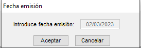{: .center }"

En la següent pantalla revisar que els participants, assistents, ponents o professors i coordinadors tinguin un només, si tenen més d'un cal assegurar-se que no estan marcats en aquests casos **certificado no impreso.**

{: .center }"

Si es una formació massiva caldrà seleccionar els que es certificaran. Si no és massiva marquem a Selecciona todos.

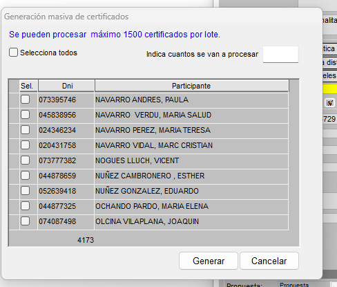{: .center }

Caldrà indicar quants volem com a màxim 1500. Podem continuar fins a finalitzar els que volem certificar.

Una vegada acceptat i generat els certificats, cal enviar-los a signatura. Cal anar a eines a **Lista Certificados Edición**

{: .center }"

Ens apareixerà una llista amb tots els certificats. Indicacions a tindre en compte:

{: .center }"

{: .center }"

{: .center }"

En modelo certificado cal que estigui o certificat amb hores per ponents o certificat general per assistents.

Per tal de generar els certificats filtrem per A (Correcte) per filtrar triem una casella on estigui la A, i anem a la part superior i donem a filtrar.

{: .center }"

A continuació seleccionem tots (per seleccionar, cal amb la tecla maj polsada clicar al primer i a l'últim registre), si estan seleccionats es posaran en blau.

Anem a la eina i triem **Validar y enviar a la firma**

{: .center }

S'obrirà una finestra on està un exemple del certificat generat. Cal comprovar:

-   En certificat d'assistent: que estiguin bé els crèdits i les hores.

-   En certificat de ponent: que hi hagi el nom de la ponència.

Si tot ok li donem a **Validar certificado.**

{: .center }"

Una vegada validats els certificats comprovar que s'han pujat a signatura de manera correcta. Cal actualitzar i comprovar que ha passat de R a B i posteriorment a F.

Per continuar caldrà treure l'ACTA FINAL, que caldrà ser signada pel coordinador. Cal anar a eines **Informes / Acta final.**

{: .center }"

Configurarem la impressora per tal que tinguem el pdf de l'acta.

!!!warning "IMPORTANT"
    Recorda que l'acta ha de tenir els logos de FSE, per tant has de marcar la casella de **Imprimir Pack Europeo(Logos FSE)**. Si es tracta d'una formació de Skills cal marcar la mateixa casella.

{: .center }"

{: .center }"

També podem previsualitzar i si tot és correcte ja li donem a imprimir per guardar l'acta en pdf.

Signar l'acta i arxivar-la a la carpeta del curs.

## ALTA EN GESFORM PONENT NO DOCENT

!!!warning "IMPORTANT"
    Des d'inici de 2025 no es permetrà l'alta de ponents no docents en Gesform, per a donar d'alta a un ponent o arreglar el nom d'un docent que no apareix bé, caldrà contactar amb compteformacio@gva.es i seran ells qui donen d'alta al ponent o arreglen el nom del docent.

A vegades hi ha ponents que no estan en Gesform, si són no docents només caldrà donar-los d'alta en Gesform, si són docents caldrà una vedada donats d'alta caldrà donar d'alta en amb les Dades docents.

Entrar a l'edició on volem posar com a ponent al participant. Anar a **Mis Ediciones -- Ver** i entrar a l'edició.

{: .center }

Anar a **Extintor -- Participantes Edición**

{: .center }

Cliquem a **Añadir nuevo registro** (3a icona)

{: .center }

Nota ignorar la finestra que apareix -- donar a **Aceptar**

{: .center }

Posem el DNI de la persona per comprovar si ja apareix al sistema -- Si no ho troba és quan s'ha de donar d'alta.

{: .center }

Apareixerà una finestra com aquesta.

{: .center }

Per afegir al nou usuari anem a **Extintor del campo de persona -- Alta**

{: .center }

Omplir les dades de la persona (la lletra del DNI no cal posar-la, si és correcte el nombre, en el quadradet blau apareixerà la lletra), una vegada omplerts els camps donem a **Aplicar -- Aceptar**

{: .center }

Una vegada donat d'alta caldrà posar-lo a l'edició, si és ponent, caldrà triar la P de Professor, si és assessor en Derecho a certificación caldrà posar que NO.

{: .center }

En el motiu caldrà buscar la paraula Cefire per identificar més fàcilment i posteriorment donar al botó per que aparega el motiu escrit al camp corresponent.

Finalment donem a **Aplicar -- Aceptar**.


-->