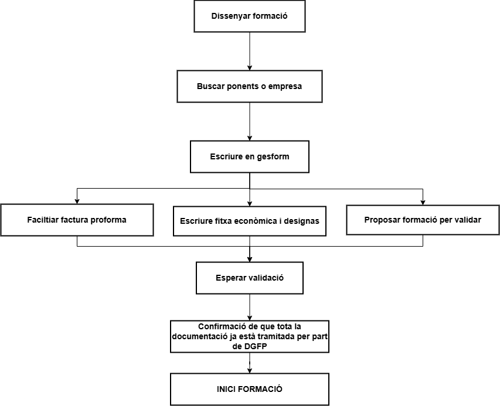
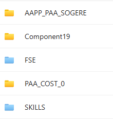
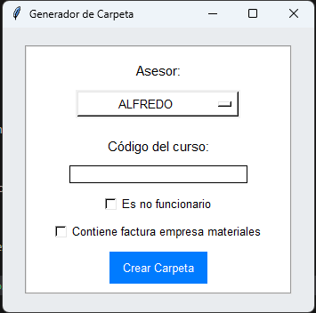

# Generar Formació

## Introducció

Abans de començar qualsevol formació hem de seguir una sèrie de passos per garantir que tot estiga en ordre. A continuació, es detallen els procediments a seguir abans d’introduir una formació en el sistema.

Podem resumir tot el procés de vida d’una formació en l’esquema següent:

{: .center}

## Documentació necessària

Una formació té diversos passos a seguir; en aquesta part abordarem el disseny de la mateixa, però cal tindre en compte que si aquesta fase no es realitza correctament, pot afectar la gestió posterior de la formació i la correcta justificació de les despeses. Per tant, podria donar-se el cas que la formació no es puga pagar.

Tota la documentació del curs s’haurà d’arxivar a la carpeta corresponent dins del canal de TEAMS "Gestió de cursos CEFIRE". És imprescindible seguir el protocol indicat per a l’enviament de documentació.

[:material-link-variant: Carpeta de cursos](https://gvaedu.sharepoint.com/:f:/r/sites/Section_46402871-C/Documentos%20compartidos/CEFIRE%20FP%2025-26/CARPETAS%20DOC%20CURSOS?csf=1&web=1&e=3prB4o){: .md-button target="_blank"}

A la carpeta trobem les subcarpetes següents:

{: .center}

Aquesta divisió es fa perquè cadascun dels cursos es paga amb campanyes diferents, per això el primer que hem de fer és tindre una campanya assignada al curs.

## Campanyes

Abans de res, és necessari que la formació estiga autoritzada pel cap de servei de formació i orientació i pel subdirector general. Disposeu d’un full de càlcul on es passen les propostes de formació; podeu accedir directament al full de càlcul des d’ací:

[:gear: Full de càlcul](https://gvaes.sharepoint.com/:x:/r/sites/SGORIENTACIIQUALIFICACIPROFESSIONALIDELIVQP_TEAMS-FormaciFP/Documentos%20compartidos/A_ordenar/Planificaci%C3%B3%20Formacions/Planificaci%C3%B3_formaci%C3%B3_families.xlsx?d=w8b95a273f3a84a3e97b12d24e4652bf9&csf=1&web=1&e=xqk4JM){: .md-button target="_blank"}

És aquest full de càlcul el que s’utilitza per planificar les formacions, i en ell s’assignen les campanyes corresponents. Una vegada tinguem la campanya assignada, podrem procedir a crear la carpeta del curs a la carpeta corresponent.

!!!warning "Atenció"
    El nom de la carpeta ha de ser el del **codi que ens proporciona Gesform**, per la qual cosa serà necessari donar d’alta la formació a Gesform abans de crear la carpeta. El nom de la carpeta serà el codi de la formació, per exemple: "26FP99CF001".

## Què he de tindre en compte abans de crear la formació?

El primer que has de tenir clar són que el curs responga a unes necessitats formatives reals i que estiga ben dissenyat. Per a això, és important que es realitze un estudi de necessitats formatives i que es tinga en compte la normativa vigent, per això es fa un formulari de necessitats formatives a tots els centres a principi de curs.

[:material-microsoft-excel: Full de càlcul](https://forms.office.com/Pages/DesignPageV2.aspx?subpage=design&FormId=FBHdc33vx0CGaVadMufim-53VF1PiF9KodJQVufWGMhUMFJBM1pDUVFVSzlSWjQzQVgwNklSRVhRTi4u&Token=f94fda4e70dc414688cd21092d85ed7f){: .md-button target="_blank"}

A més del full de necessitats formatives, caldrà que tinguem en compte un document de seguiment en cual es veuen les noves necessitats formatives que vagen sortint al llarg del curs:

[:material-file-excel-box: Full de seguiment](https://forms.office.com/Pages/DesignPageV2.aspx?subpage=design&FormId=FBHdc33vx0CGaVadMufim-53VF1PiF9KodJQVufWGMhUOUI1WFlITFFSWVhSSTJKUDVWRjhLNDZYMC4u&Token=f4c44a5d0ae94a95807c2c1366f40bf8){: .md-button target="_blank"}

Després caldrà que tingues clars els objectius i continguts que vas a tractar en el curs, així com els recursos que necessitaràs per a impartir-lo. És un part necessària que necessitaràs per a fer la fitxa de gesform.

Després cal tenir clar el pagament dels ponents. Hi ha varies casuístiques a l'hora de contratar els ponents:

* **Jo mateix**: és recomanable com a assessor del CEFIRE crear algun curs i impartir.lo, en aquest cas no cal fer la FITXA ECONÒMICA, ja que no es paga res.
* **Ponent de la GVA**: És l'opció més recomanable de totes per a fer pagament, és la menys problemes dona i només cal fer la FITXA ECONÒMICA i especificar-ho en observacions.
* **Ponent extern**: En aquest cas caldrà especificar-ho en observacions a la FITXA ECONÒMICA, a més de fer un Informe de necessitat de contractació, que s'ha d'enviar al cap de servei de formació i orientació i al subdirector general. Aquest informe ha d'estar degudament justificat i caldrà adjuntar el currículum del ponent.
* **Empresa externa** (**no es por realitzar cap formació d'este tipus de moment**): És l'opció menys recomanable de totes, la que més problemes dona i la que cal estar més justificada. És molt fàcil equivocar-se i que hi haja problemes amb el pagament. En aquest cas és necessari omplir els següents documents:
  * **Informe de necessitat de contractació de l'empresa**
  * **Autorització d'ús de materials oberts**
  * **Autorització de gravació i difusió**
  * **Factura proforma** de l'empresa degudament complimentada amb totes les dades necessàries. Aquestes dades són:
    * Dades de l'empresa
    * Dades del CEFIRE
    * Dades del curs: CODI i NOM
    * Import brut
    * Import total
    * Número total d'hores de la formació
    * Número de participants
    * Dates de realització de la formació
    * Família professional
    * IVA corresponent: cal afegir la coletilla "Factura exenta de IVA según art. 20.1.9 de la ley 37-1992 de 28 de diciembre" si l'empresa està exempta d'IVA.
    * Número de compte bancari on s'ha de fer el pagament
    * Teniu tota la documentació als [següent document que caldrà facilitar a l'empresa](https://gvaedu.sharepoint.com/:b:/r/sites/Section_46402871-C/Documentos%20compartidos/CEFIRE%20FP%2025-26/DOCUMENTACI%C3%93N%20PARA%20EDICIONES/GESTI%C3%93N%20ECON%C3%93MICA/MI%20CURSO%20TIENE%20FACTURAS/INSTRUCCIONES%20FACTURACION%20FACE_2025_sdgfp.pdf?csf=1&web=1&e=QTUKOq).
    * Cal detallar les instruccions per a pujar la **factura a la plataforma FACE**, que és la plataforma de gestió de factures electròniques del Ministeri d'Hisenda. És important que l'empresa tinga un usuari registrat en aquesta plataforma i que puga pujar la factura correctament. [Teniu un document explicatiu ací](https://gvaedu.sharepoint.com/:b:/r/sites/Section_46402871-C/Documentos%20compartidos/CEFIRE%20FP%2025-26/DOCUMENTACI%C3%93N%20PARA%20EDICIONES/GESTI%C3%93N%20ECON%C3%93MICA/MI%20CURSO%20TIENE%20FACTURAS/Manual_detallado_FACe-Manual-Proveedores.pdf?csf=1&web=1&e=nVz8xA). Cal insistir que la factura no es pot pujar a la plataforma FACE fins que no s'haja finalitzat la formació.

!!!warning "Atenció"
    La factura ha d'estar degudament pujada per l'empresa, caldrà que et **faciliten una còpia de la factura proforma** abans de començar la formació. Una vegada finalitzada la formació, l'empresa haurà de pujar la factura definitiva a la plataforma FACE i enviar-te una còpia de la mateixa. Després caldrà fer la [CONFORMITAT del servei realitzat per l'empresa](https://gvaedu.sharepoint.com/:w:/r/sites/Section_46402871-C/Documentos%20compartidos/CEFIRE%20FP%2025-26/DOCUMENTACI%C3%93N%20PARA%20EDICIONES/GESTI%C3%93N%20ECON%C3%93MICA/MI%20CURSO%20TIENE%20FACTURAS/24FPXXCFXX_CONFORMIDAD_NOMBREEMPRESA.docx?d=w4fdda2776f394e959a03b6e87042e5e0&csf=1&web=1&e=2QVNeS), que és un document que certifica que el servei s'ha prestat correctament i que es pot procedir al pagament de la factura. Aquest document s'ha d'enviar a l'administrativa del CEFIRE.

!!!info "A tenir en compte"
    Gesform distinguix entre **ponents i professors**, si s'impartixen més de 19h és professor i si són menys de 19h és ponent. Intenteu evitar altres opcions com la de tutor ja que en moltes convocatòries no apareix la paraula tutor i pot fer que no li baremen correctament el mèrit.

Si la formació **necessita de materials per a poder realitzar-se** caldrà especificar-ho a la FITXA ECONÒMICA i adjuntar un informe de necessitat de contractació de materials, la documentació necessària per a això és la següent:

* Empresa externa (**no es por realitzar cap formació d'este tipus de moment**): És l'opció menys recomanable de totes, la que més problemes dona i la que cal estar més justificada. És molt fàcil equivocar-se i que hi haja problemes amb el pagament. En aquest cas és necessari omplir els següents documents:

  * Informe de necessitat de contractació de l'empresa
  * Factura proforma de l'empresa degudament complimentada amb totes les dades necessàries. Aquestes dades són:
    * Dades de l'empresa
    * Dades del CEFIRE
    * Dades del curs: CODI i NOM
    * Import brut
    * Import total
    * Número total d'hores de la formació
    * Número de participants
    * Dates de realització de la formació
    * Família professional
    * IVA corresponent
    * Número de compte bancari on s'ha de fer el pagament
    * Teniu tota la documentació als [següent document que caldrà facilitar a l'empresa](https://gvaedu.sharepoint.com/:b:/r/sites/Section_46402871-C/Documentos%20compartidos/CEFIRE%20FP%2025-26/DOCUMENTACI%C3%93N%20PARA%20EDICIONES/GESTI%C3%93N%20ECON%C3%93MICA/MI%20CURSO%20TIENE%20FACTURAS/INSTRUCCIONES%20FACTURACION%20FACE_2025_sdgfp.pdf?csf=1&web=1&e=QTUKOq).
    * Cal detallar les instruccions per a pujar la factura a la plataforma FACE, que és la plataforma de gestió de factures electròniques del Ministeri d'Hisenda. És important que l'empresa tinga un usuari registrat en aquesta plataforma i que puga pujar la factura correctament. [Teniu un document explicatiu ací](https://gvaedu.sharepoint.com/:b:/r/sites/Section_46402871-C/Documentos%20compartidos/CEFIRE%20FP%2025-26/DOCUMENTACI%C3%93N%20PARA%20EDICIONES/GESTI%C3%93N%20ECON%C3%93MICA/MI%20CURSO%20TIENE%20FACTURAS/Manual_detallado_FACe-Manual-Proveedores.pdf?csf=1&web=1&e=nVz8xA). Cal insistir que la factura no es pot pujar a la plataforma FACE fins que no s'haja finalitzat la formació.

!!!warning "Atenció"
    La factura ha d'estar degudament pujada per l'empresa, caldrà que et faciliten una còpia de la factura proforma abans de començar la formació. Una vegada finalitzada la formació, l'empresa haurà de pujar la factura definitiva a la plataforma FACE i enviar-te una còpia de la mateixa. Després caldrà fer la [CONFORMITAT del servei realitzat per l'empresa](https://gvaedu.sharepoint.com/:w:/r/sites/Section_46402871-C/Documentos%20compartidos/CEFIRE%20FP%2025-26/DOCUMENTACI%C3%93N%20PARA%20EDICIONES/GESTI%C3%93N%20ECON%C3%93MICA/MI%20CURSO%20TIENE%20FACTURAS/24FPXXCFXX_CONFORMIDAD_NOMBREEMPRESA.docx?d=w4fdda2776f394e959a03b6e87042e5e0&csf=1&web=1&e=2QVNeS), que és un document que certifica que el servei s'ha prestat correctament i que es pot procedir al pagament de la factura. Aquest document s'ha d'enviar a l'administrativa del CEFIRE.

!!!warning "Atenció"
    Els materials que es compren per a fer les formacions han de ser materials **NO INVENTARIABLES**. No es pot adquirir un llibre, o un dispositiu electrònic, o qualsevol altre material que puga ser inventariat. Els materials han de ser consumibles, i que no tinguen altre contracte associat amb l'administració com ara paper, cartutxos d'impressora, etc.

!!!warning "Errades comuns"
    És molt habitual crear un informe copiant i pegant del model. **Utilitzeu el model com a referència**, però no copieu i pegueu el text. És important que **el text siga original i que s'adapte a les necessitats del curs**. A més, cal tindre en compte que si es copia i pega el text, pot haver-hi errades de format o de contingut que poden afectar la justificació de les despeses.

**És imprescindible que els pagaments s'adeqüen a les tarifes vigents**, per això caldrà que consulteu les tarifes vigents per a l'any en curs. Podeu trobar les tarifes vigents al següent enllaç:

* [Tarifes 2025.](https://gvaedu.sharepoint.com/:b:/r/sites/Section_46402871-C/Documentos%20compartidos/CEFIRE%20FP%2025-26/DOCUMENTACI%C3%93N%20PARA%20EDICIONES/GESTI%C3%93N%20ECON%C3%93MICA/TARIFAS/TARIFAS_JUNIO_%202025_firmado.pdf?csf=1&web=1&e=pEZneE)
* [Annex Tarifes 2025.](https://gvaedu.sharepoint.com/:b:/r/sites/Section_46402871-C/Documentos%20compartidos/CEFIRE%20FP%2025-26/DOCUMENTACI%C3%93N%20PARA%20EDICIONES/GESTI%C3%93N%20ECON%C3%93MICA/TARIFAS/ANEXO%20TARIFAS.pdf?csf=1&web=1&e=S5exhl)

## Introducció a Gesform

Una vegada tinguen clara la formació i el que necessite caldrà introduïr-la a Gesform. Per a això, caldrà accedir a la plataforma Gesform i donar d'alta la formació. És important que seguisques els passos correctament i que omplis tots els camps necessaris.

[:material-school: Tutorial Gesform](alta_formacion.md){: .md-button target="_blank"}

Així, quan ja tingues el codi de la formació, podràs crear la carpeta corresponent a la formació a la carpeta de cursos del CEFIRE i tindre en compte tots els documents necessaris a posar dins de la carpeta.

## Documentació dins de la formació

Una vegada creada la carpeta, hem de crear una sèrie de subcarpetes i arxius per a organitzar la documentació del curs. Els documments necessaris són els següents:

* **25FPXXCF0XX_FITXA ECONÒMICA.pdf**: Es tracta de la fitxa econòmica del curs, on es detallen els costos i pressupostos. És imprescindible que aquesta fitxa estiga ben omplerta i no tinga cap errada, les errades de esta fitxa **NO ES PODEN CORREGIR** ja que s'inicien procesos que fan difícil corregir els canvis que ací es posen.
* **25FPXXCF0XX_DATOS PONENTE_NOMBRE.pdf**: Es tracta d'un document on es detallen totes les dades del ponent, cal que estiga correctament omplert i que no tinga cap errada. [Podeu trobar el document ací](https://gvaedu.sharepoint.com/:b:/r/sites/Section_46402871-C/Documentos%20compartidos/CEFIRE%20FP%2025-26/DOCUMENTACI%C3%93N%20PARA%20EDICIONES/DOC%20PARA%20PONENTES/DADES%20PONENTS_validat.pdf?csf=1&web=1&e=LRWip3).
* **25FPXXCF0XX_AutorizacionUsoMaterialesAbierto**:Autorització per a l'ús de materials oberts, és un document que cal omplir i signar per part del ponent. [Podeu trobar el document ací](https://gvaedu.sharepoint.com/:b:/r/sites/Section_46402871-C/Documentos%20compartidos/CEFIRE%20FP%2025-26/DOCUMENTACI%C3%93N%20PARA%20EDICIONES/DOC%20PARA%20PONENTES/AutorizacionUsoMaterialesAbierto.pdf?csf=1&web=1&e=mrhuPh).
* **25FPXXCF0XX_AutorizacionGrabacionYDifusion**: Autorització per a la gravació i difusió de la formació, és un document que cal omplir i signar per part del ponent. [Podeu trobar el document ací](https://gvaedu.sharepoint.com/:b:/r/sites/Section_46402871-C/Documentos%20compartidos/CEFIRE%20FP%2025-26/DOCUMENTACI%C3%93N%20PARA%20EDICIONES/DOC%20PARA%20PONENTES/AutorizacionGrabacionYDifusion.pdf?csf=1&web=1&e=3Sx8VL).
* **25FPXXCF0XX_PROPER_PONENTE**: És necessari que el ponent es done d'alta en la plataforma PROPER abans de començar la formació i que vos facilite el document de confirmació d'alta. Comproveu que el número de compte siga el mateix que el de les dades que ha facilitat en la Fitxa DADES PONENTE. 
* **25FPXXCF0XX_Modelo informe necesidad_VAL_V3**: Si el ponent no és funcionari GVA cal fer un informe de perquè estàs fent esta contractació. És cert que no hi ha cap ponent en tota la família professional que no puga impartir el curs, cal justificar-ho. [Podeu trobar el document ací](https://gvaedu.sharepoint.com/:w:/r/sites/Section_46402871-C/Documentos%20compartidos/CEFIRE%20FP%2025-26/DOCUMENTACI%C3%93N%20PARA%20EDICIONES/GESTI%C3%93N%20ECON%C3%93MICA/INFORME%20DE%20NECESIDADES/Informe%20motivado%20de%20necesidad%20de%20ponente%20NO%20FUNCIONARIO%20VAL.docx?d=wd33d83fbf5b74fe2be1626f35b9c61ef&csf=1&web=1&e=xCBwnC).
* **25FPXXCF0XX-Tec**: Cal crear una subcarpeta on es posaran totes les evidències necessàries per a justificar la formació. 
  * **25FPXXCF0XX_CuadroTexto**: Es tracta d'un formulari que cal emplenar.
  * **25FPXXCF0XX_Evidencias**: On es posaran totes les evidències necessàries per a justificar la formació. Baners, publicació en web, fotos, etc...
  * **25FPXXCF0XX_FSE_Ficha_seguimiento**: On es posarà la fitxa de seguiment de la formació.
  * **25FPXXCF0XX_ACTA FINAL.pdf**: Acta amb els APTES i NO APTES de la formació, cal que estiga degudament omplerta i signada per part del ponent, es trau de gesform.
  * **25FPXXCF0XX_ACTA PONENT.pdf**: Acta signada pel ponent on posa els APTES i NO APTES de la formació, la genera ell/a.
  * **25FPXXCF0XX_SIGNATURES.pdf**: Document amb totes les signatures de la formació escanejades.
* **25FPXXCF0XX_DESIGNA_NOM_PONENT_FSE.pdf**: (Convocatòria FSE) Aquest document és necessari per a designar el ponent de la formació, cal que estiga degudament omplert i signat pel cap de servei de formació i orientació i pel subdirector general, caldrà facilitar-lo per la plataforma Kanban que hem habilitat per a que es signe. [Podeu trobar el document ací](https://gvaedu.sharepoint.com/:w:/r/sites/Section_46402871-C/Documentos%20compartidos/CEFIRE%20FP%2025-26/DOCUMENTACI%C3%93N%20PARA%20EDICIONES/GESTI%C3%93N%20ECON%C3%93MICA/DESIGNA_CONFORMIDAD_CERTIFICA/FSE/25FPXXCFXX_DESIGNA_PLANTILLA2.docx?d=wf067d1053ab14cb3996bf711e12c9f2f&csf=1&web=1&e=dXFsre).
* **25FPXXCF0XX_DESIGNA_NOM_PONENT_SKILLS.pdf**: (Convocatòria SKILLS) Aquest document és necessari per a designar el ponent de la formació, cal que estiga degudament omplert i signat pel cap de servei de formació i orientació i pel subdirector general, caldrà facilitar-lo per la plataforma Kanban que hem habilitat per a que es signe. [Podeu trobar el document ací si és docent GVA](https://gvaedu.sharepoint.com/:w:/r/sites/Section_46402871-C/Documentos%20compartidos/CEFIRE%20FP%2025-26/DOCUMENTACI%C3%93N%20PARA%20EDICIONES/GESTI%C3%93N%20ECON%C3%93MICA/DESIGNA_CONFORMIDAD_CERTIFICA/SKILLS/01_DESIGNE_docent_2025_Plantilla.docx?d=w059eaad56517418d924e1ce19f1e95c2&csf=1&web=1&e=T6OpkG). En el cas que no siga docent GVA, caldrà fer un informe de necessitat de contractació i [utilizar aquest document de DESIGNA](https://gvaedu.sharepoint.com/:w:/r/sites/Section_46402871-C/Documentos%20compartidos/CEFIRE%20FP%2025-26/DOCUMENTACI%C3%93N%20PARA%20EDICIONES/GESTI%C3%93N%20ECON%C3%93MICA/DESIGNA_CONFORMIDAD_CERTIFICA/SKILLS/01_Designe_NO_docent_2025_Plantilla.docx?d=wc71a5d088d3f488e8ffc0ba0dc71872d&csf=1&web=1&e=kQcKjr).

# APLICACIÓ PER A CREAR CARPETA

Hem creat unes aplicacions per a facilitar la creació de carpetes i la pujada de documentació. 

* [Aplicació per a crear carpetes de formacions en Windows](../Docs/carpeta_curso.exe){: .md-button target="_blank"}
* [Aplicació per a crear carpetes de formacions en Linux](../Docs/crea_cursos_linux){: .md-button target="_blank"}

L'ús és molt senzill poseu el vostre nom d'assessor i el codi de la formació i es crearà la carpeta amb totes les subcarpetes necessàries. A més, també es crearà un arxiu de text amb les dades de la formació per a que pugueu omplir-lo amb tota la documentació necessària.

{: .center}

!!!note "Nota"
    Cal donar permisos per a executar l'aplicació en Linux. chmod +x crea_cursos_linux

# IMPORTANT

Una vegada es tinga tota la documentació ja podria pasar la formació a "Inscripció". Per favor quan creeu la formació, depenent de cada campanya, tindrà unes cosideracions o altres, podeu anar a cadascuna de les campanyes i veure les consideracions que cal tindre en compte per a cada una d'elles.

* **FSE**: [Consideracions FSE](fse.md)
* **Skills**: [Consideracions Skills](skills.md)
* **PAA**: [Consideracions PAA](paa.md)
* **Component19**: [Consideracions Component19](C19.md)

**SI LA DOCUMENTACIÓ NO ESTÀ CORRECTA, EL CURS NO POT COMENÇAR**

