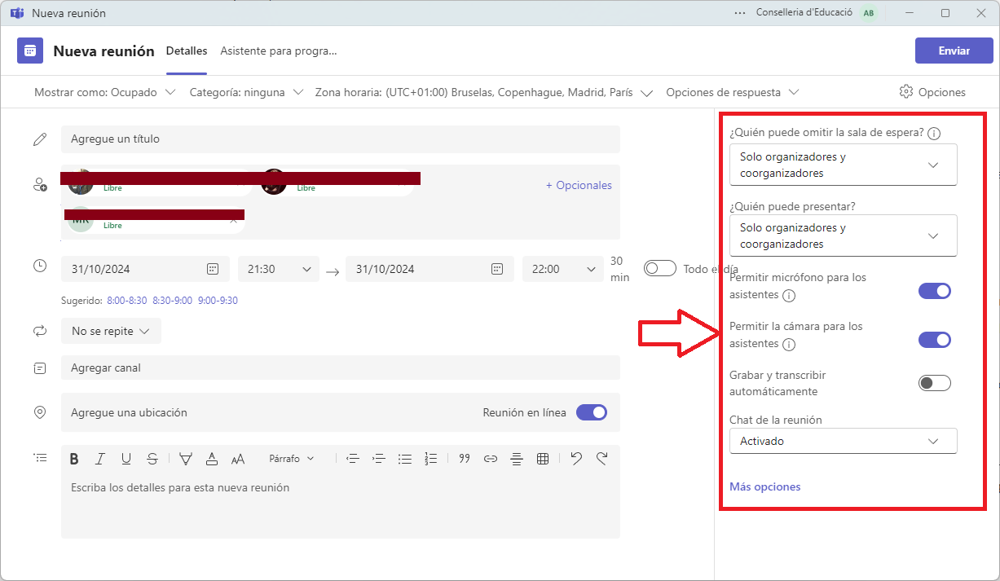
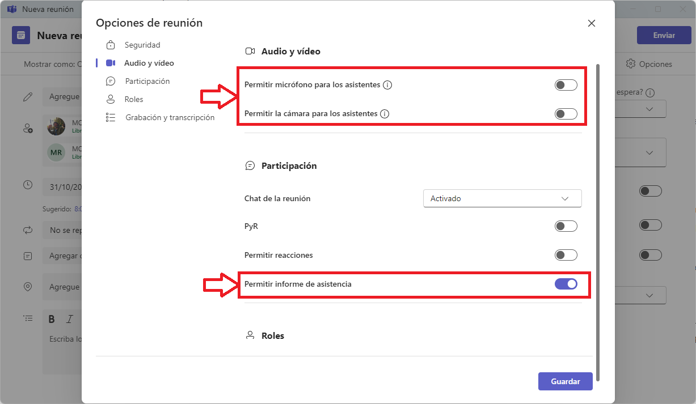
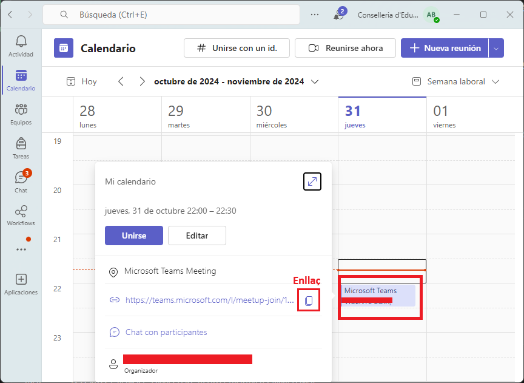
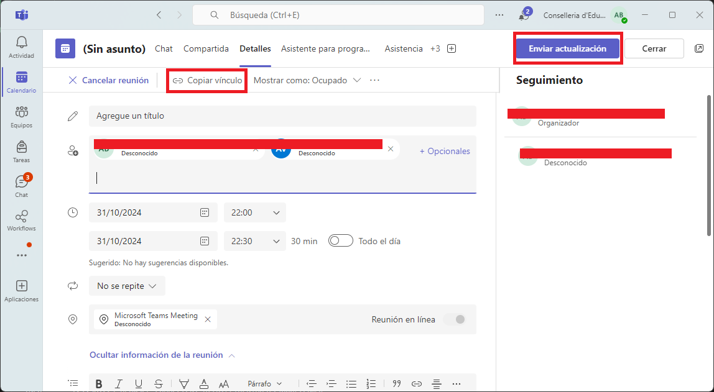
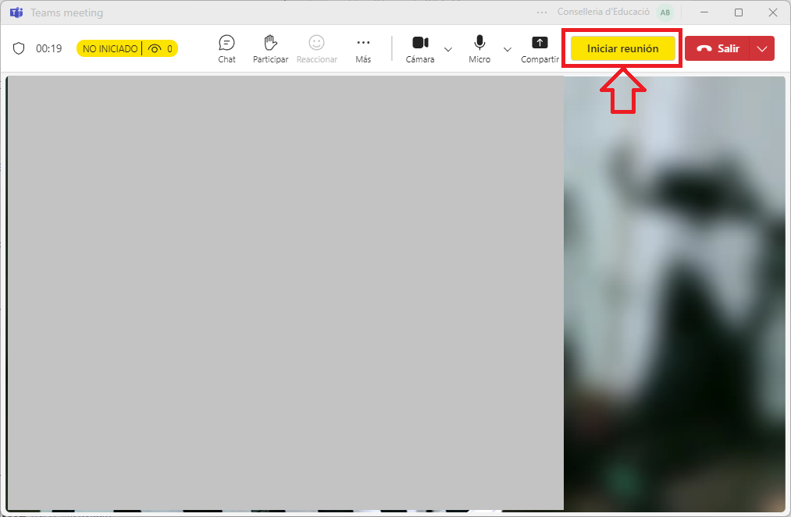

# Recomanacions per a crear una sessió de Teams

|Ver.|:material-tag:0.2 :date: 11/04/2025|

!!!info "Introducció"
    Teams és una eina de Microsoft que permet la comunicació i la col·laboració en línia. Per a poder utilitzar-la, cal tindre una llicència de Microsoft 365. 

    En esta guia, es donaran algunes recomanacions per a crear una sessió de Teams per a una sessió estàndard.

## Crear una sessió

!!!warning "Compte!"
    L'explicació que es va a fer va ser per al sistema operatiu Windows. Donat que en moltes ocassions és recomanable si vas a coordiandr una sessió utilitzar el programari Teams.

El primer que farem serà assegurar-nos que estem creant la reunió en el nostre compte de edu.gva.es i en el domini de Conselleria d'educació (No GENERALITAT) . Després anem a crear una "Nova reunió" en Teams.

Però hem de tenir en compte per a aquest tipus de sessions tan massives que hem de crer una **conferència**.

!!!warning "Compte!"
    Si vos equivoqueu no podeu canviar la modalitat de reunió. Heu de crear-la de nou i esborrar la que heu creat.

## Configuració de la reunió

Crear la reunio amb la configuració adequada és molt important. Per a això, hem de tindre en compte els següents punts:

* Un títol clar i concís, que especifique de quina formació estem parlant.
* Afegir a tots els coordinadors de la sessió com a organitzadors.
* Afegir els dies correctes.
* Afegir l'hora d'inici i de finalització.

A un costat ens apareixen les primeres opcions de la reunió.

Hem de tenir cura de canviar les opcions:

* Permetre la càmera als assistents per a que no tinguen la càmera activada.
* Permetre el micròfon als assistents per a que no puguen parlar.
* A més, hem de fer que puguen ometre la sala d'espera, ja que sinó tidràs que acceptar-los a tots.

Ara anem a Més opcions.

## Altres opcions

!!!danger "Perill!!"
    És molt important que habiliteu la "Sala verde", així podreu fer proves durant la reunió.

Podem veure que l'opció d'ometre la sala d'espera està activada.

En assegurem que els assistents no puguen activar la càmera ni el micròfon i activem Permetre l'informe d'assistència.

Cal que escollim a tots els coorganitzadors possibles, tot i que no vagen a intervindre ja que sempre pot passar alguna cosa i és millor que estiguen.

Activem la part de Gravar la reunió i la de Transcripció.

!!!warning "Compte!"
    Tingueu en compte que quan ens unim a la reunió no significa que la reunió haja començat, 

Uan vegada tenim fet açò recorderu donar a **Guardar** i després a **Enviar**.

## Compartir la sessió

Per a poder compartir la sessió podeu fer clic sobre la sessió creada i copiar l'enllaç.

També podeu compartir la sessió amb editar i fen clic en **Copiar enllaç**.

!!!warning "Compte!"
    Si feu cap modificació, recordeu donar a **Enviar actualización**

## En la reunió

Quan comenceu la reunió, recordeu que podeu fer servir la sala verda per a fer proves. La reunió no començará per a tots els assistents fins que no doneu a **Iniciar reunión**.

